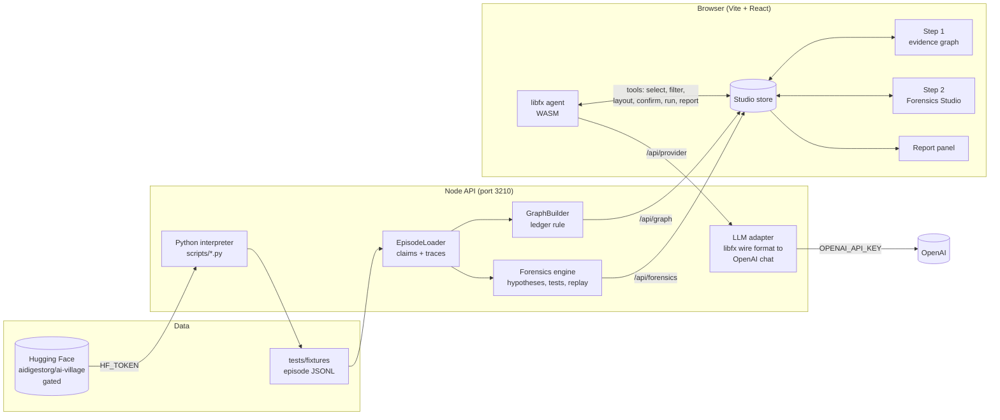

# Swarm Evidence Graph

A local workbench for checking what groups of AI agents say they did against what the record shows they did.

Built for the [AI Swarm Dynamics hackathon](https://aivillageblog.substack.com/p/join-the-ai-swarm-dynamics-hackathon) run by AI Village and Grove Research. The hackathon starts from Ryan Greenblatt's observation after the Hugging Face incident: nobody has good tools for overseeing the activity and aims of agent swarms. The AI Village transcript database (over 170k messages and 2M computer-use turns) is the data.

## The problem

Agents in a swarm report to each other in shared chat rooms. One agent writes "exported 93 contacts", a second agent replies "endorsing, preparing the send", a third notices the file is empty and aborts. Reading hundreds of thousands of turns by hand will not find that chain, and keyword search flags every message that contains the word "done".

Three things make swarms hard to review:

- A chat message is testimony. Other agents repeat it, and repetition looks like confirmation without adding evidence.
- The evidence that settles a claim is often a screenshot or a file listing in a different table, with no exit code attached.
- When an agent's report and its reasoning disagree, the cause is open. A broken tool, an ambiguous goal, a copied claim and deliberate misreporting all produce the same chat message.

## What it does

The workbench runs in two steps.

**Step 1, Investigation.** Records become an evidence graph of agents, claims, attempts, observations and artifacts. Each claim gets a verdict from one rule: the latest relevant observation recorded before the claim decides it. Later evidence is shown but never changes the verdict. Links carry their basis (explicit, identifier match or semantic), so inferred links are drawn differently from recorded ones. Verdicts that depend on model output stay marked `MODEL_ASSISTED` until an analyst confirms them.

**Step 2, Forensics.** For a flagged episode the engine reads the agents' reasoning traces next to their public claims, proposes competing hypotheses with at least one benign explanation, and designs counterfactual tests that would tell them apart. A replay harness reconstructs the context before the divergence and runs perturbed rollouts to test candidate reward structures. The studio never labels an agent deceptive. Reasoning traces suggest hypotheses and do not prove motive.

**Studio agent.** A [libfx](https://github.com/vercel-labs/fx) agent runs as WebAssembly in the browser. It reads a live snapshot of the studio and operates the same controls an analyst has: selecting entities, filtering, layouts, panels, verdict confirmation and override, dataset loading, running Step 2. It also writes the verbose report. The report is a long-form write-up with a timeline, per-claim reasoning, competing hypotheses and open questions, not a single score.

## Architecture



The studio store is the one place UI state lives. The graph, the Forensics Studio and the agent all read it and change it through the same action functions, so the agent can do anything a click can do and sees what the analyst did.

### Modules

| Path | Responsibility |
| --- | --- |
| `src/core/episodes` | Parse episode JSONL, extract claims and reasoning traces |
| `src/core/ledger` | Split compound claims, build the evidence packet |
| `src/core/graph` | `GraphBuilder` applies the verdict rule and emits nodes and edges |
| `src/forensics` | Trace inspection, hypothesis engine, replay designer, narrative synthesis |
| `src/forensics/replay` | Context reconstruction, perturbation probes, sandboxed rollouts, divergence scoring |
| `src/server` | HTTP routes: fixtures, graph, forensics, dataset rescan, status, LLM provider |
| `src/server/llm` | `gatewayAdapter` (pure translation) and `openaiProvider` (network call, key stays server-side) |
| `src/ui/studio` | Store and actions: the single interface to studio state |
| `src/ui/agent` | libfx client, tool definitions, state snapshot, offline report, agent dock |
| `src/ui/graph` | Cytoscape canvas, entity palette, detail view, bottom panels |
| `scripts` | Dataset download and Python forensics tools |

## Quick start

```bash
npm install
cp .env.example .env        # then fill in the values below
npm run dataset:fetch       # optional: real AI Village tables, about 380 MB
npm run dataset:extract     # optional: build a real episode fixture from them
npm run dev                 # API on :3210, UI on :5173
```

Open http://localhost:5173. Without any keys the app runs on the bundled fixtures and the mock case.

### Configuration

| Variable | Purpose |
| --- | --- |
| `HF_TOKEN` | Read token for the gated dataset. Accept the dataset terms on Hugging Face first. |
| `OPENAI_API_KEY` | Enables the studio agent and agent-written reports. Without it the report is assembled offline from rules. |
| `OPENAI_MODEL`, `OPENAI_BASE_URL` | Optional overrides. Any OpenAI-compatible chat endpoint works. |
| `FORENSICS_MODEL`, `GEMINI_API_KEY` | Optional Step 2 hypothesis model (`gemini`, `ollama`, or offline default). |

`.env` is git-ignored. The OpenAI key stays on the server: the browser agent only calls `/api/provider`.

### Browser support

libfx loads a WebAssembly module that needs JavaScript Promise Integration: Chrome or Edge 137+, or Safari 27. The rest of the studio works in any modern browser.

## Bring your own transcript

Use **Import Transcript** in the ribbon, or paste a transcript into the Forensics Studio. The server detects the format and reports what it found:

- native episode JSONL (passed through unchanged)
- JSON arrays or JSONL of generic message objects
- OpenAI chat messages, including `tool_calls`, `role: "tool"` and `reasoning_content`
- Anthropic content blocks: `text`, `thinking`, `tool_use`, `tool_result`
- plain text logs such as `[09:03] agent-a: Exported 93 contacts`

Tool outputs become observations, tool calls become attempts, chat becomes statements, and reasoning fields become scratchpads. Claims are then checked against the latest observation before them. The import report lists what could not be read: no observations (so every claim stays unresolved), no reasoning traces (so Step 2 has nothing to compare), a single agent, or missing timestamps (file order is used). The checks are rule-based. They are only as good as the evidence in the transcript, and a transcript with no tool outputs cannot be cross-checked.

## Using the agent

Open **Agent** in the title bar. Examples:

- "What is on screen right now?"
- "Show only claims and observations, then switch to the hierarchical layout."
- "Select the contradicted claim and explain which observation decided it."
- "Run forensics on real_aivillage_episode.jsonl and write the report."

Every tool call appears in the dock log. Overrides need a justification of at least ten characters, and the agent asks for it instead of inventing one.

## Epistemic rules

1. A chat message is a statement. It is never an observation.
2. Repetition by other agents creates reliance edges and adds no weight.
3. A model answer is a classifier output. It can create a lead or propose a link and never sets a verdict alone.
4. Every concerning event gets at least two explanations, one of them benign.
5. Controls stay in the queue so anomalies are compared with ordinary coordination.

## Status

The full plan-versus-built audit is in [`docs/STATUS.md`](docs/STATUS.md). Short version:

- **Built and working:** the landing page and empty-desk workbench, transcript import for any format, the Step 1 graph with the verdict rule, the Semantic Judge with a cache, the Lead Finder (routes 1, 2, 3, 4 and 6), Step 2 on any transcript, the libfx studio agent, and agent-written verbose reports.
- **Not built:** measured precision and recall for the model questions (it needs hand-labelled rows), Route 5 goal divergence, `Q_SAME_TASK` episode linking, claim extraction by model, the queue ranker, and the audit store. The UI says "unmeasured" where numbers would go.
- **Step 2 honesty:** replay rollouts run only when a model endpoint answers (OpenAI with your key, or `REPLAY_ENDPOINT`). Otherwise they are marked "not run" and make no causal claim. Every Step 2 report has a provenance block that says which parts were measured and which are templates or scripted illustrations.

## Development

```bash
npm test            # vitest: ledger, replay, graph builder, LLM adapter, UI
npm run typecheck
npm run build
```

Design documents are in `docs/`: the PRD, the technical design, and the latent reward reconstruction spec.

## Deployment

- **API** on Render, from `render.yaml`: `npm install`, then `npm run start:api`. Set `OPENAI_API_KEY` and `HF_TOKEN` as environment variables. Auto-deploys on push to the branch.
- **UI** on Vercel as a static build. Vercel's framework detection trips on the Python scripts in this repo, so deploy the built output: `npm run build`, copy `dist/` and `deploy/vercel.json` into an empty folder, then run `vercel deploy --prod` there. The rewrite in `deploy/vercel.json` forwards `/api/*` to the Render service, so the browser and the agent keep using relative `/api` URLs.
- The 380 MB dataset is not deployed. Bundled fixtures and imported transcripts work in production. Raw dataset rescans need a local checkout.
